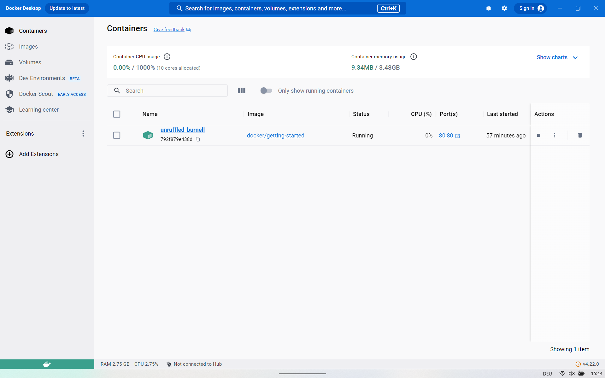
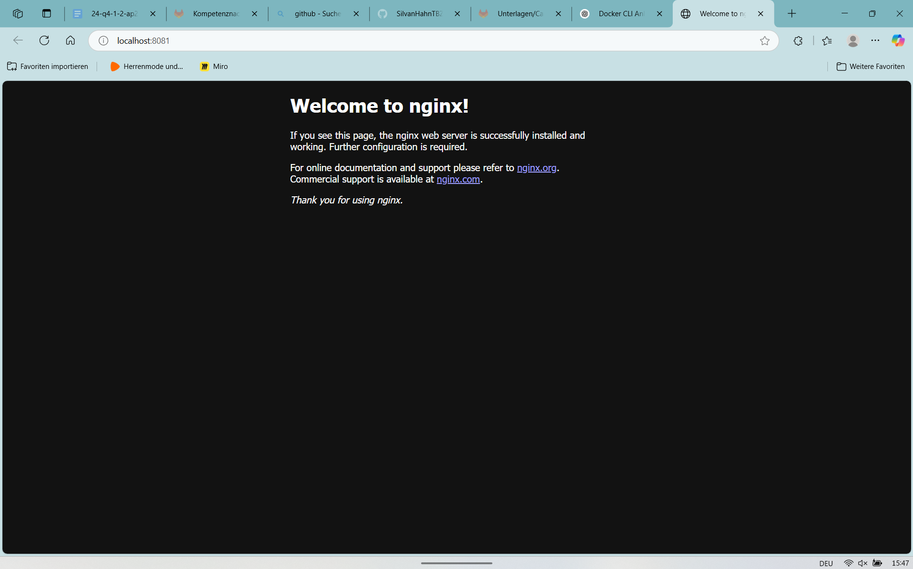
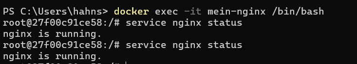
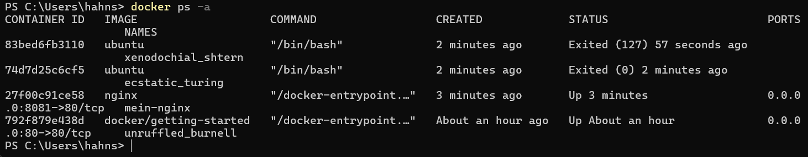
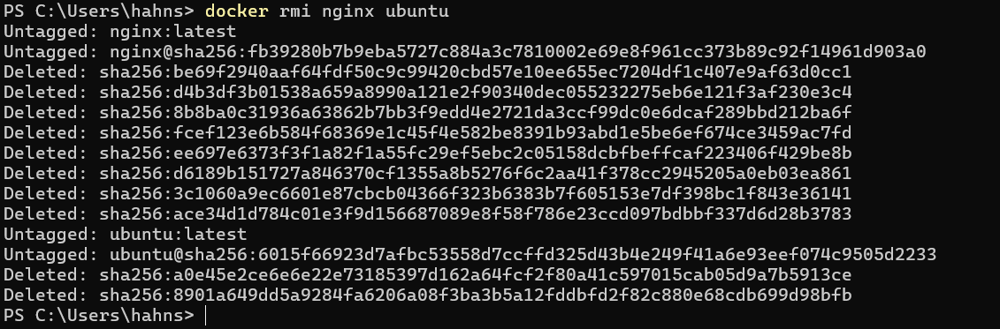
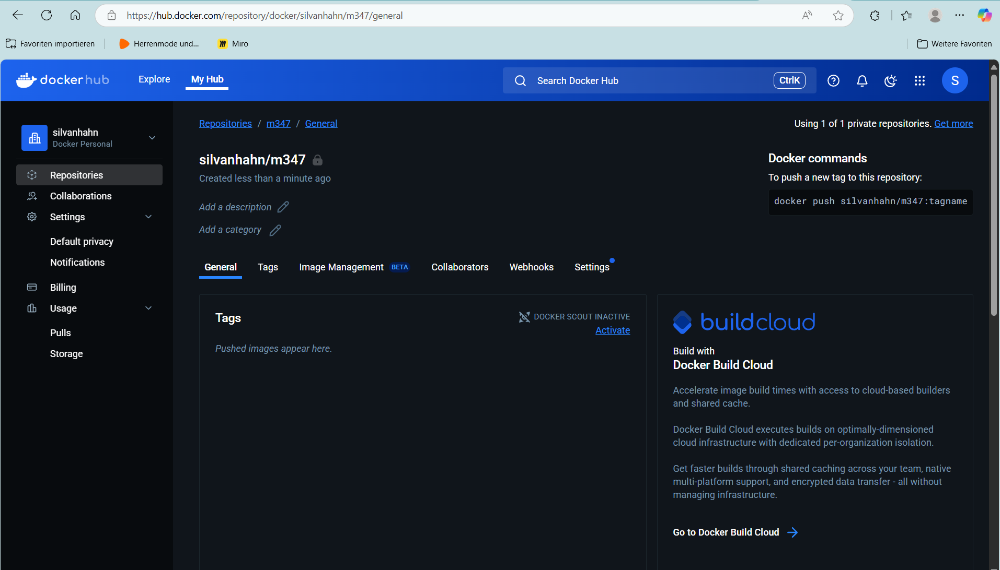
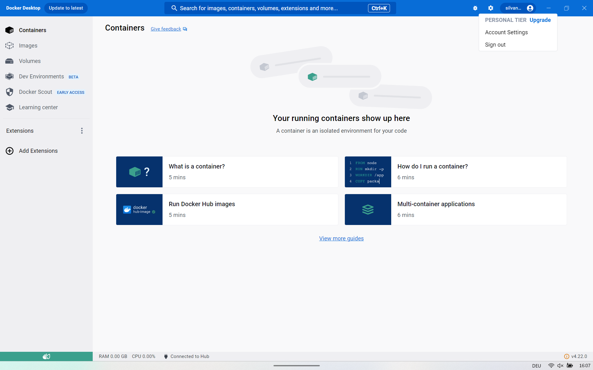
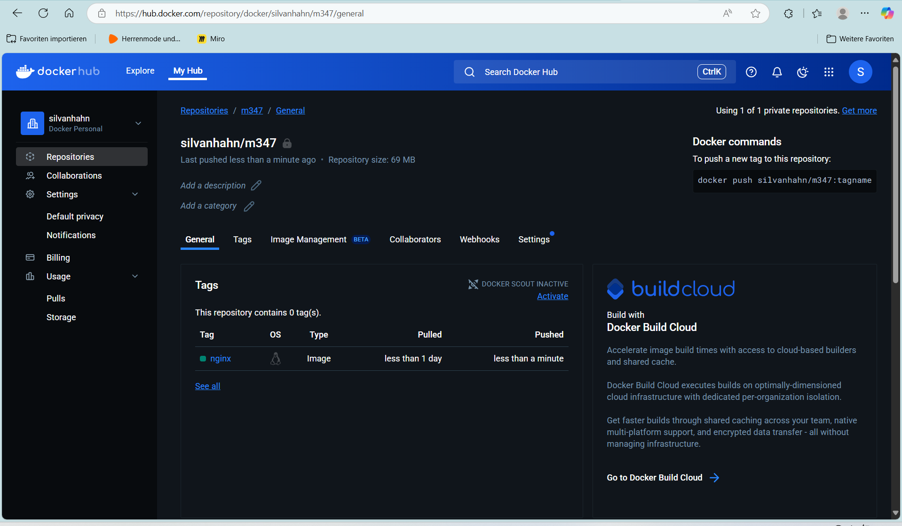

A



B






# KN01: Docker Grundlagen – Teil B (CLI)

## Überblick
In diesem Teil lernen wir den Umgang mit dem Docker Command Line Interface (CLI) anhand typischer Befehle wie `run`, `pull`, `exec`, `stop`, `rm`, etc. Wir arbeiten mit den Images `docker/getting-started`, `nginx` und `ubuntu`.

---

## Verwendete Befehle & Erklärungen

### Docker-Version anzeigen

```bash
docker --version
```
 Ausgabe:
```
Docker version 24.0.5, build ced0996
```

---

###  Suche nach offiziellen Images

```bash
docker search ubuntu
docker search nginx
```


---

###  Getting Started Container starten

```bash
docker run -d -p 80:80 docker/getting-started
```

 Erklärung:
- `-d`: Detached mode (läuft im Hintergrund)
- `-p 80:80`: Port-Mapping (localhost:80 → Container:80)
- `docker/getting-started`: Verwendetes Image

 Screenshot der Webseite im Browser: `image.png`

---

###  NGINX Image

#### 1. Image laden

```bash
docker pull nginx
```

#### 2. Container erstellen

```bash
docker create -p 8081:80 --name mein-nginx nginx
```

#### 3. Container starten

```bash
docker start mein-nginx
```

 Screenshot von http://localhost:8081: 

---

###  Ubuntu Container

#### 1. Im Hintergrund starten

```bash
docker run -d ubuntu
```

 Erklärung:
- Image wurde automatisch heruntergeladen.
- Container beendet sich sofort, da kein Dienst aktiv ist.

#### 2. Interaktiv starten

```bash
docker run -it ubuntu
```

 Erklärung:
- Startet eine interaktive Shell.
- Nutzer kann direkt Befehle im Container ausführen.

```bash
exit
```

---

###  Interaktive Shell im laufenden Container

```bash
docker exec -it mein-nginx /bin/bash
service nginx status
```

 Screenshot vom Status: 

```bash
exit
```

---

###  Container-Status anzeigen

```bash
docker ps -a
```

 Screenshot Ausgabe:

---

###  Container stoppen

```bash
docker stop mein-nginx
```

---

###  Container löschen

```bash
docker container prune -f
docker rm $(docker ps -a -q)
```

---

###  Images löschen

```bash
docker rmi nginx ubuntu
```

---

---

##  Fazit

Mit diesen Schritten hast du erfolgreich:
- Images geladen
- Container erstellt, gestartet, gestoppt und gelöscht
- Die CLI zur Verwaltung von Containern genutzt
- Interaktive Shells geöffnet


### C
---






 ### D:

##  Ziel
- Eigene Docker Images taggen und in ein privates Repository hochladen.
- Verständnis für `docker tag` und `docker push` vertiefen.
- NGINX und MariaDB in das private TBZ-Repository übertragen.

---

##  Vorgehen

###  1. NGINX Image vorbereiten

```bash
docker pull nginx
docker tag nginx:latest silvanhahn/m347:nginx
```

 **Erklärung zu `docker tag`**  
Der Befehl erstellt ein neues Tag für ein vorhandenes Image.  
- `nginx:latest` → `silvanhahn/m347:nginx`  
- So wird das Image deinem Repository unter einem neuen Namen zugeordnet.

---

###  2. NGINX Image ins Repository pushen

```bash
docker push silvanhahn/m347:nginx
```

**Erklärung zu `docker push`**  
Lädt das lokal getaggte Image in dein Repository bei Docker Hub hoch.

**Screenshot nach Upload im Repository sichtbar:**  


---

###  3. MariaDB Image vorbereiten und hochladen

```bash
docker pull mariadb
docker tag mariadb:latest silvanhahn/m347:mariadb
docker push silvanhahn/m347:mariadb
```


##  Zusammenfassung

| Befehl                       | Beschreibung                                       |
|-----------------------------|----------------------------------------------------|
| `docker tag`                | Weist einem lokalen Image einen neuen Namen zu     |
| `docker push`               | Überträgt ein Image ins Docker Hub Repository     |

