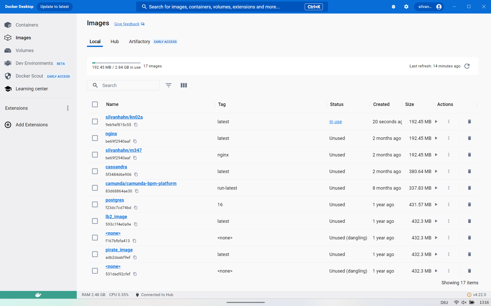
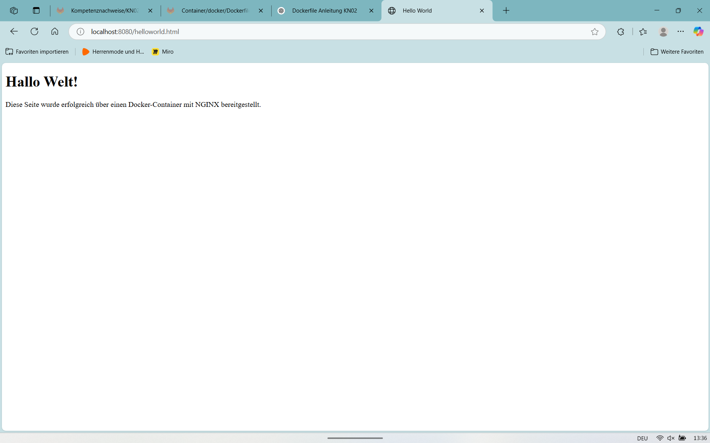
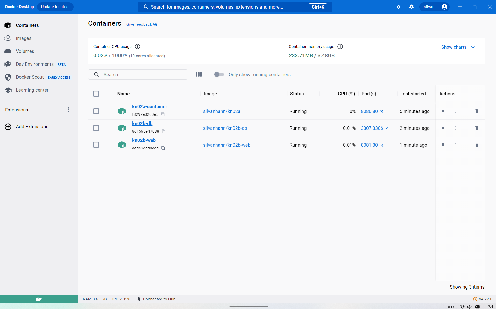
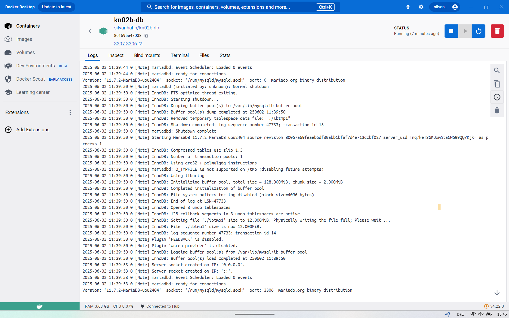
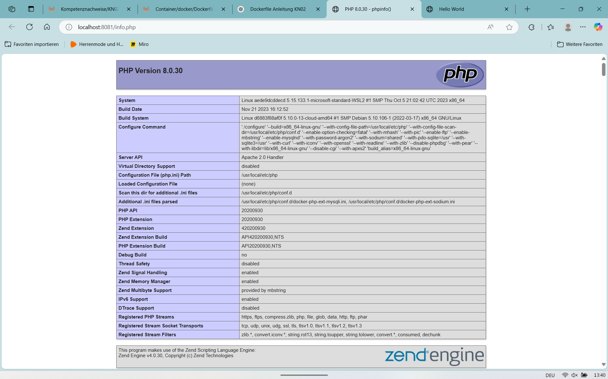
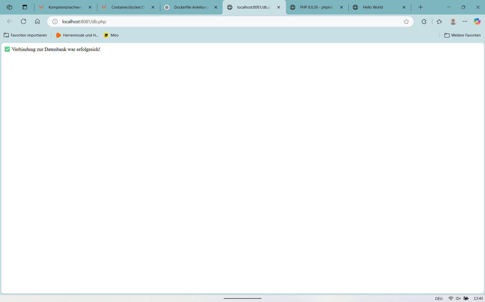

# KN02: Dockerfile

## Grundlagen
Dieser Auftrag umfasst zwei Teile:
- **A)** Erstellen eines Dockerfiles basierend auf dem offiziellen `nginx`-Image mit statischer HTML-Seite.
- **B)** Erstellung zweier Docker-Container: einer für eine MariaDB-Datenbank, einer für eine PHP-Webseite mit `info.php` und `db.php`.

---

## Teil A – Dockerfile I: NGINX + HTML

###  Dokumentiertes Dockerfile

```dockerfile
# Wir starten mit dem offiziellen nginx Image als Basis
FROM nginx

# Wir setzen das Arbeitsverzeichnis, um relative Pfade zu verwenden
WORKDIR /usr/share/nginx/html

# Kopieren der HTML-Datei in das Webverzeichnis
COPY helloworld.html .

# Wir öffnen Port 80, damit der Webserver erreichbar ist
EXPOSE 80
```

###  Projektstruktur

```
kn02a/
├── Dockerfile
└── helloworld.html
```

###  Verwendete Befehle

```bash
# Image bauen
docker build -t silvanhahn/kn02a .

# Container starten
docker run -d -p 8080:80 --name kn02a-container silvanhahn/kn02a

# Image pushen
docker push silvanhahn/kn02a
```

### 🔍 Test

Browser öffnen und Seite aufrufen:  
[http://localhost:8080/helloworld.html](http://localhost:8080/helloworld.html)

### 📸 Screenshots




---

## Teil B – Dockerfile II: PHP + MariaDB

### 🔹 Datenbank-Container (MariaDB)

 `kn02b/db/Dockerfile`

```dockerfile
FROM mariadb

ENV MARIADB_ROOT_PASSWORD=rootpass
ENV MARIADB_DATABASE=demo

EXPOSE 3306
```

###  Befehle

```bash
cd kn02b/db
docker build -t silvanhahn/kn02b-db .

# Falls Port 3306 bereits belegt ist, z.B. mit 3307 starten:
docker run -d --name kn02b-db -p 3307:3306 silvanhahn/kn02b-db
```

###  Screenshots




---

### 🔹 Webserver-Container (PHP + Apache)

 `kn02b/web/Dockerfile`

```dockerfile
FROM php:8.0-apache

RUN docker-php-ext-install mysqli

WORKDIR /var/www/html

COPY info.php .
COPY db.php .
```

###  Befehle

```bash
cd ../web
docker build -t silvanhahn/kn02b-web .

docker run -d --name kn02b-web --link kn02b-db:db -p 8081:80 silvanhahn/kn02b-web
```

Browser öffnen:

- [http://localhost:8081/info.php](http://localhost:8081/info.php)
- [http://localhost:8081/db.php](http://localhost:8081/db.php)

###  Screenshots





---

##  PHP-Dateien (für Web-Container)

### `info.php`

```php
<?php
phpinfo();
?>
```

### `db.php`

```php
<?php
$host = 'db';
$user = 'root';
$password = 'rootpass';
$database = 'demo';

$mysqli = new mysqli($host, $user, $password, $database);

if ($mysqli->connect_error) {
    die("Verbindung zur Datenbank fehlgeschlagen: " . $mysqli->connect_error);
} else {
    echo "✅ Verbindung zur Datenbank war erfolgreich!";
}
?>
```

---

##  Docker Hub Push

```bash
docker push silvanhahn/kn02b-db
docker push silvanhahn/kn02b-web
```

---

