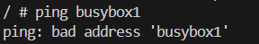

# KN03: Netzwerk, Sicherheit

## Ziel des Auftrags

In dieser Aufgabe wurde die Netzwerkkommunikation zwischen Docker-Containern untersucht. Ziel war es, vier `busybox`-Container in zwei unterschiedlichen Netzwerken laufen zu lassen – zwei im `default bridge`-Netzwerk und zwei im selbst erstellten `tbz`-Netzwerk – und deren Kommunikation sowie Netzwerkkonfiguration zu testen.

---

## Aufbau der Netzwerke

###  Erstellen eines user-defined Netzwerks `tbz`

Ein eigenes Netzwerk mit dem Subnetz `172.18.0.0/16` wurde angelegt:

```bash
docker network create --subnet=172.18.0.0/16 tbz
```


---

## Container-Konfiguration

###  Starten der Container

Vier `busybox`-Container wurden erstellt:

```bash
# Default bridge Netzwerk
docker run -dit --name busybox1 busybox
docker run -dit --name busybox2 busybox

# User-defined Netzwerk tbz
docker run -dit --name busybox3 --net tbz busybox
docker run -dit --name busybox4 --net tbz busybox
```


---

## IP-Adressen & Netzwerkinfos

###  Ermitteln der IP-Adressen

```bash
docker inspect -f '{{.Name}} - {{range .NetworkSettings.Networks}}{{.IPAddress}}{{end}}' busybox1 busybox2 busybox3 busybox4
```


---

## Netzwerktests

###  Test aus busybox1 (default network)

Interaktive Session:

```bash
docker exec -it busybox1 sh
```

Im Container wurden folgende Befehle ausgeführt:

```bash
ifconfig
ip route
ping -c 4 busybox2
ping -c 4 busybox3
ping -c 4 <IP-von-busybox2>
ping -c 4 <IP-von-busybox3>
```


---

###  Test aus busybox3 (tbz network)

Interaktive Session:

```bash
docker exec -it busybox3 sh
```

Im Container wurden folgende Befehle ausgeführt:

```bash
ifconfig
ip route
ping -c 4 busybox1
ping -c 4 busybox4
ping -c 4 <IP-von-busybox1>
ping -c 4 <IP-von-busybox4>
```





---

## Analyse und Erklärung

 **Netzwerkzugehörigkeit:**

- `busybox1`, `busybox2` → im default `bridge`-Netzwerk
- `busybox3`, `busybox4` → im user-defined Netzwerk `tbz`

 **Namensauflösung:**

- Im `default bridge`-Netzwerk ist **nur Kommunikation über IP** möglich.
- Im `tbz`-Netzwerk ist **Kommunikation über IP und Containernamen** möglich.

 **Default-Gateway:**

- Jeder Container hat einen Gateway im jeweiligen Subnetz.
- Container im gleichen Netzwerk teilen sich denselben Gateway.


 **Verbindbarkeit:**

- Container im selben Netzwerk können sich pingen.
- Container in verschiedenen Netzwerken **können sich nicht pingen**, es sei denn, explizite Verbindung über ein gemeinsames Netzwerk wird konfiguriert.


---

## Rückblick auf KN02

> In welchem Netzwerk befanden sich die beiden Container?

→ Im `default bridge`-Netzwerk

> Wieso konnten sie miteinander kommunizieren?

→ Nur über **direkte IP-Adressen**, da im `bridge`-Netzwerk keine automatische Namensauflösung erfolgt. Ein benutzerdefiniertes Netzwerk wie `tbz` bietet hier mehr Funktionalität.

---

## Fazit

- Docker bietet mit benutzerdefinierten Netzwerken (`user-defined bridge`) wesentlich mehr Kontrolle über Namensauflösung und Verbindungen.
- Für komplexe Container-Kommunikation ist das Standard-Bridge-Netzwerk ungeeignet.
- Netzwerkanalyse-Tools wie `ping`, `ifconfig` und `ip route` sind hilfreich zur Fehlersuche und Konfiguration.

```bash
# Beispiel: Begrenzter Ping
ping -c 4 busybox2
```


