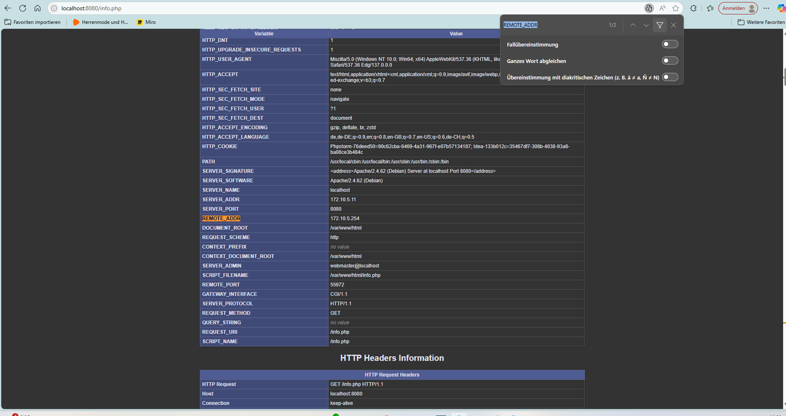

# KN04: Docker Compose – Webserver & Datenbank lokal und in der Cloud

## Teil A: Docker Compose lokal (60%)

### A.a) Verwendung von Original-Images

#### Ziel
Mit Docker Compose zwei Container starten:
- `m347-kn04a-web` (PHP-Apache Webserver via Dockerfile)
- `m347-kn04a-db` (MariaDB über offizielles Image)

#### Projektstruktur
```
kn04a/
├── docker-compose.yml
└── web/
    ├── Dockerfile
    ├── info.php
    └── db.php
```

#### Dockerfile
```dockerfile
FROM php:8.2-apache
RUN docker-php-ext-install mysqli
COPY . /var/www/html/
```

#### docker-compose.yml (Teil A.a)
```yaml
version: '3.8'

services:
  m347-kn04a-db:
    image: mariadb:latest
    container_name: m347-kn04a-db
    environment:
      MYSQL_ROOT_PASSWORD: rootpass
      MYSQL_DATABASE: testdb
      MYSQL_USER: testuser
      MYSQL_PASSWORD: testpass
    networks:
      kn04-net:
        ipv4_address: 172.10.5.10

  m347-kn04a-web:
    build: ./web
    container_name: m347-kn04a-web
    ports:
      - "8080:80"
    depends_on:
      - m347-kn04a-db
    networks:
      kn04-net:
        ipv4_address: 172.10.5.11

networks:
  kn04-net:
    driver: bridge
    ipam:
      config:
        - subnet: 172.10.0.0/16
          ip_range: 172.10.5.0/24
          gateway: 172.10.5.254
```

#### Docker-Befehle und Bedeutung
```bash
docker compose up --build
```
Dieser Befehl führt unter anderem folgende Schritte aus:
- `docker build`: Baut das Webserver-Image
- `docker network create`: Erstellt das benutzerdefinierte Netzwerk
- `docker create` und `docker start`: Erstellen und starten die Container
- `docker logs`: Zeigt Container-Logs

#### Screenshots Teil A.a
**info.php**  


**db.php**  


---

### A.b) Verwendung eigener Images (DockerHub)

#### Ziel
Verwendung eines gepushten Webserver-Images:  
`silvanhahn/webserver-kn04a:latest`

#### docker-compose.yml (Teil A.b)
```yaml
version: '3.8'

services:
  m347-kn04a-db:
    image: mariadb:latest
    container_name: m347-kn04a-db
    environment:
      MYSQL_ROOT_PASSWORD: rootpass
      MYSQL_DATABASE: testdb
      MYSQL_USER: testuser
      MYSQL_PASSWORD: testpass
    networks:
      kn04-net:
        ipv4_address: 172.30.5.10

  m347-kn04a-web:
    image: silvanhahn/webserver-kn04a:latest
    container_name: m347-kn04a-web
    ports:
      - "8080:80"
    depends_on:
      - m347-kn04a-db
    networks:
      kn04-net:
        ipv4_address: 172.30.5.11

networks:
  kn04-net:
    driver: bridge
    ipam:
      config:
        - subnet: 172.30.0.0/16
          ip_range: 172.30.5.0/24
          gateway: 172.30.5.254
```

#### Erklärung zu db.php
Obwohl die Aufgabe ursprünglich erwartet, dass `db.php` einen Fehler liefert, funktioniert sie korrekt. Grund: Das gepushte Image enthält bereits eine korrekte Konfiguration mit gültigem Datenbank-Hostnamen (`m347-kn04a-db`) und installiertem `mysqli`. Die Verbindung funktioniert daher wie vorgesehen.

#### Screenshots Teil A.b
**info.php**  


**db.php**  


---

## Teil B: Docker Compose in der Cloud (40%)

### Ziel
Die Docker-Compose-Umgebung aus Teil A wurde in der Cloud (AWS EC2) automatisiert bereitgestellt. Die vollständige Installation erfolgte über ein Cloud-Init-Skript. Nach dem Start standen Webserver und Datenbank direkt zur Verfügung.

### Vorgehen

1. Start einer EC2-Instanz mit Ubuntu 22.04 LTS (t2.micro)
2. Verwendung eines eigenen SSH-Schlüssels (PEM-Datei)
3. Eingabe des Cloud-Init-Skripts im Feld "User data"
4. Sicherheitsgruppe mit HTTP-Zugriff (Port 80) konfiguriert
5. Aufruf der PHP-Seiten info.php und db.php über die öffentliche IP

### Screenshots

**EC2-Instanzübersicht mit öffentlicher IP-Adresse:**  


**info.php im Browser aufgerufen (mit IPs):**  


**db.php mit erfolgreicher Verbindung zur MariaDB:**  


---

### Cloud-Init Datei

```yaml
#cloud-config
package_update: true
package_upgrade: true
users:
  - name: ubuntu
    sudo: ALL=(ALL) NOPASSWD:ALL
    groups: users, admin
    home: /home/ubuntu
    shell: /bin/bash
    ssh_authorized_keys:
      - ssh-rsa AAAAB3NzaC1...dein-schlüssel...Qr5 teacher

packages:
  - apt-transport-https
  - ca-certificates
  - curl
  - gnupg
  - lsb-release
  - unattended-upgrades

write_files:
  - path: /home/ubuntu/docker-compose.yml
    permissions: '0644'
    content: |
      version: '3.8'
      services:
        m347-kn04a-db:
          image: mariadb:latest
          container_name: m347-kn04a-db
          environment:
            MYSQL_ROOT_PASSWORD: rootpass
            MYSQL_DATABASE: testdb
            MYSQL_USER: testuser
            MYSQL_PASSWORD: testpass
          networks:
            kn04-net:
              ipv4_address: 172.50.5.10

        m347-kn04a-web:
          image: silvanhahn/webserver-kn04a:latest
          container_name: m347-kn04a-web
          ports:
            - "80:80"
          depends_on:
            - m347-kn04a-db
          networks:
            kn04-net:
              ipv4_address: 172.50.5.11

      networks:
        kn04-net:
          driver: bridge
          ipam:
            config:
              - subnet: 172.50.0.0/16
                ip_range: 172.50.5.0/24
                gateway: 172.50.5.254

runcmd:
  - mkdir -p /etc/apt/keyrings
  - curl -fsSL https://download.docker.com/linux/ubuntu/gpg | gpg --dearmor -o /etc/apt/keyrings/docker.gpg
  - echo "deb [arch=$(dpkg --print-architecture) signed-by=/etc/apt/keyrings/docker.gpg] https://download.docker.com/linux/ubuntu $(lsb_release -cs) stable" | tee /etc/apt/sources.list.d/docker.list > /dev/null
  - apt-get update
  - apt-get install -y docker-ce docker-ce-cli containerd.io docker-compose-plugin
  - curl -L "https://github.com/docker/compose/releases/download/v2.23.3/docker-compose-linux-x86_64" -o /usr/local/bin/docker-compose
  - chmod +x /usr/local/bin/docker-compose
  - docker-compose -f /home/ubuntu/docker-compose.yml up -d

final_message: "Docker Compose Setup abgeschlossen!"
```

---

## Liste der Befehle, die `docker compose up` ausführt und deren Erklärungen

Der Befehl `docker compose up --build` automatisiert den Start der Container-Umgebung. Dabei führt Docker Compose im Hintergrund folgende Schritte aus – basierend auf deiner Konfiguration:

| Schritt | Befehl                      | Erklärung                                                                 |
|--------:|-----------------------------|---------------------------------------------------------------------------|
| 1.      | `docker build`              | Baut das Webserver-Image aus dem lokalen Dockerfile (`build:` verwendet) |
| 2.      | `docker network create`     | Erstellt das benutzerdefinierte Netzwerk `kn04-net` mit IP-Konfiguration |
| 3.      | `docker create`             | Erstellt die Container gemäß `docker-compose.yml`                        |
| 4.      | `docker start`              | Startet die Container                                                    |
|

 Wichtig: Das Flag `--build` sorgt dafür, dass **lokale Dockerfiles neu gebaut** werden – auch wenn ein Image bereits vorhanden ist.

