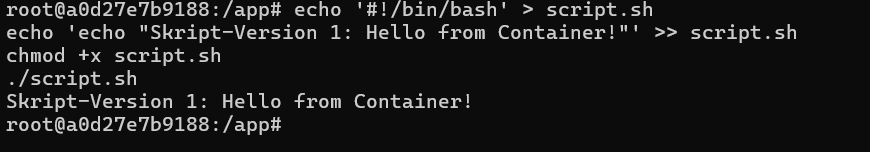
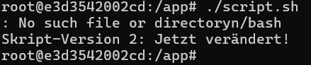
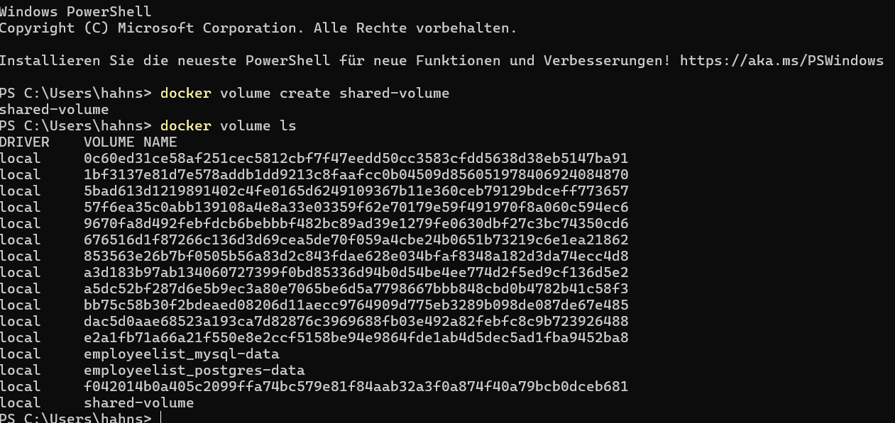
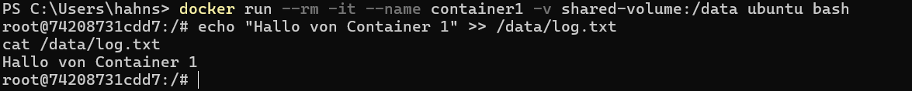
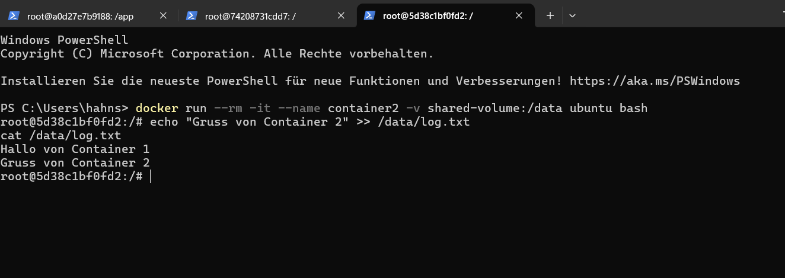
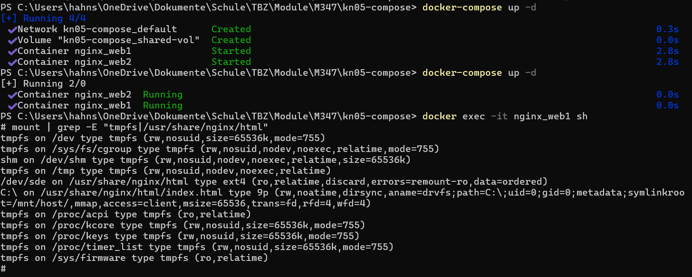
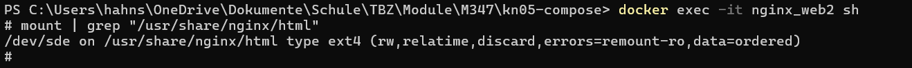

# KN05 – Arbeit mit Speicher (Docker)

## Teil A: Bind Mounts (40%)

In diesem Teil wurde demonstriert, wie ein **Bind Mount** zwischen Host-System und Container funktioniert. Ziel war es, zu zeigen, dass Änderungen an Dateien im Host direkt im Container sichtbar sind.

---

###  Verwendete Befehle

```bash
docker run --rm -it -v "C:\Users\hahns\OneDrive\Dokumente\Schule\TBZ\Module\M347\kn05-bind:/app" -w /app ubuntu bash
chmod +x script.sh
./script.sh
```

---

###  Verwendetes Skript (`script.sh`)

**Erste Version:**

```bash
#!/bin/bash
echo "Skript-Version 1: Hello from Host!"
```

**Zweite Version (nach Änderung auf dem Host):**

```bash
#!/bin/bash
echo "Skript-Version 2: Jetzt verändert!"
```

---

###  Screenshots




---

###  Fazit

Durch die Verwendung eines Bind Mounts war es möglich, ein Bash-Skript auf dem Windows-Host zu erstellen und es im Container direkt auszuführen. Änderungen am Skript auf dem Host waren sofort im Container sichtbar, was den Nutzen von Bind Mounts in der Entwicklungsumgebung deutlich macht.

## Teil B: Volumes (30%)

In diesem Teil wurde demonstriert, wie mehrere Container auf ein gemeinsames Docker Volume zugreifen können. Ziel war es zu zeigen, dass Daten, die in einem Container geschrieben werden, auch im anderen sichtbar sind.

---

###  Verwendete Befehle

```bash
# Volume erstellen
docker volume create shared-volume

# Container 1 starten und schreiben
docker run --rm -it --name container1 -v shared-volume:/data ubuntu bash
# Im Container:
echo "Hallo von Container 1" >> /data/log.txt
cat /data/log.txt

# Container 2 starten und ebenfalls schreiben/lesen
docker run --rm -it --name container2 -v shared-volume:/data ubuntu bash
# Im Container:
echo "Gruss von Container 2" >> /data/log.txt
cat /data/log.txt
```

---

###  Screenshots

- `b_volume_erstellen.png` – zeigt das Erstellen des Volumes mit `docker volume create`

- `b_container1_write.png` – zeigt das Schreiben und Lesen von Container 1

- `b_container2_read_and_write.png` – zeigt das Schreiben von Container 2 und das Lesen beider Inhalte


---

###  Fazit

Mit einem Docker Named Volume können mehrere Container persistent auf dieselben Daten zugreifen. In diesem Test konnten beide Container erfolgreich Nachrichten in eine gemeinsame Datei schreiben und die Inhalte jeweils lesen. Dies ist besonders nützlich für gemeinsame Datenhaltung oder Synchronisation in Multi-Container-Anwendungen.

## Teil C: Speicher mit Docker Compose (30%)

In diesem Teil wurde gezeigt, wie man mithilfe von Docker Compose drei verschiedene Speichertypen in einem Setup verwendet:

- **Named Volume** (von Docker verwaltet)
- **Bind Mount** (Verzeichnis oder Datei vom Host eingebunden)
- **tmpfs Mount** (flüchtiger Speicher im RAM, ideal für temporäre Daten)

---

###  Verwendete `docker-compose.yml`

```yaml
version: "3.9"

services:
  web1:
    image: nginx
    container_name: nginx_web1
    volumes:
      - shared-vol:/usr/share/nginx/html:ro       # Named Volume (Long Syntax)
      - ./index.html:/usr/share/nginx/html/index.html  # Bind Mount
    tmpfs:
      - /tmp

  web2:
    image: nginx
    container_name: nginx_web2
    volumes:
      - shared-vol:/usr/share/nginx/html          # Named Volume (Short Syntax)

volumes:
  shared-vol:
```

---

###  Verwendete Befehle

```bash
# Projektordner vorbereiten
mkdir kn05-compose
cd kn05-compose
echo "<h1>Hallo vom Host</h1>" > index.html

# Container starten
docker-compose up -d

# Mounts in Container 1 prüfen
docker exec -it nginx_web1 sh
mount | grep -E "tmpfs|/usr/share/nginx/html"

# Mounts in Container 2 prüfen
docker exec -it nginx_web2 sh
mount | grep "/usr/share/nginx/html"

# Container stoppen und aufräumen
docker-compose down
```

---

###  Screenshots

- `c_web1_mounts.png` – zeigt, dass im Container `nginx_web1`:
  - das Named Volume
  - das Bind Mount
  - und das tmpfs Mount korrekt gemountet sind

- `c_web2_mounts.png` – zeigt, dass im Container `nginx_web2` nur das Named Volume eingebunden ist


---

###  Fazit

Mit Docker Compose können komplexe Speicheranforderungen einfach konfiguriert werden. Dieses Beispiel zeigt, wie unterschiedliche Speichertypen kombiniert werden können:
- Bind Mounts für schnelle Entwicklung (Host-Dateien direkt im Container)
- Named Volumes für dauerhafte Containerdaten
- tmpfs für temporäre Laufzeitdaten im RAM (z. B. Caching, Logs)

Das Setup lief wie gewünscht: Beide Container teilen sich das Named Volume, während nur Container `web1` zusätzlich mit Bind Mount und tmpfs arbeitet.

