# KN06: Kubernetes I – MicroK8s auf AWS

## Überblick

In diesem Auftrag wurde ein Kubernetes-Cluster mit drei Nodes mittels **MicroK8s auf AWS EC2** aufgebaut. Der Auftrag gliedert sich in zwei Teile:

- **Teil A: Installation des Clusters**
- **Teil B: Verständnis und Analyse des Clusters**

---

##  A) Installation (50 %)

###  Ziel:
Ein funktionierender MicroK8s-Cluster mit 3 EC2-Nodes innerhalb eines gemeinsamen Subnetzes.

---

### 1. Subnetz in AWS anlegen  
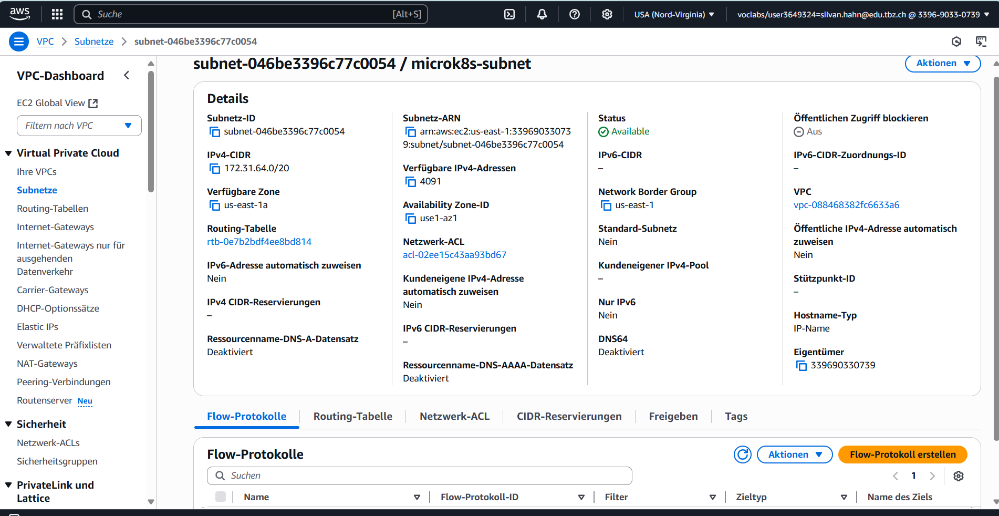

### 2. Sicherheitsgruppe mit SSH & internem Zugriff  
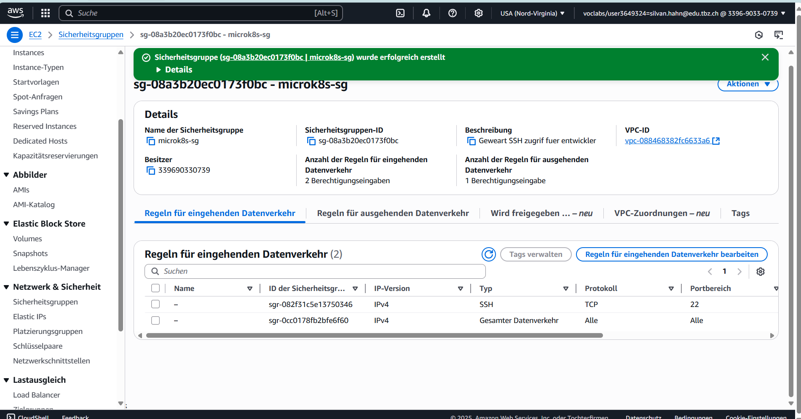

### 3. Netzwerkschnittstellen konfigurieren  
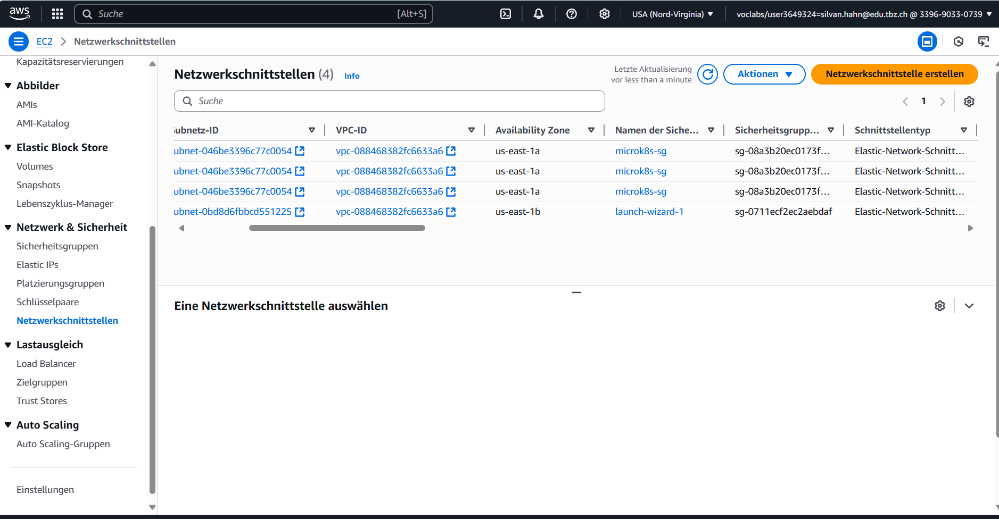

### 4. Instanzen starten mit Ubuntu 24.04, MicroK8s & Schlüssel  


---

### 5. MicroK8s auf Node 1 starten  


### 6. MicroK8s auf Node 2 starten  


### 7. MicroK8s auf Node 3 starten  


---

### 8. Prüfung, ob alle Nodes im Cluster sichtbar sind  
```bash
microk8s kubectl get nodes
```
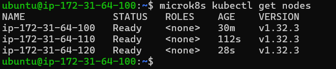

---

##  B) Verständnis für Cluster (50 %)

---

### 🔹 B01: `microk8s kubectl get nodes` auf Node 2
```bash
microk8s kubectl get nodes
```
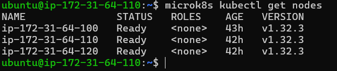

---

### 🔹 B02: `microk8s status` auf Node 2
```bash
microk8s status
```
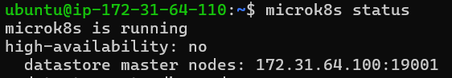

**Erklärung:**  
Oben sieht man, ob die Node Teil eines HA-Clusters ist und ob sie ein `datastore master` ist. Diese Angaben zeigen, ob diese Node Control-Plane-Aufgaben übernimmt.

---

### 🔹 B03: Node 3 verlässt den Cluster
```bash
microk8s leave
```
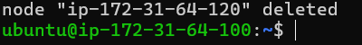

---

### 🔹 B04: `get nodes` auf Master (Node 1) nach dem Leave
```bash
microk8s kubectl get nodes
```
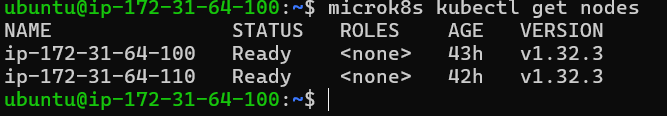

---

### 🔹 B05: Join-Befehl auf Master erzeugen
```bash
microk8s add-node
```
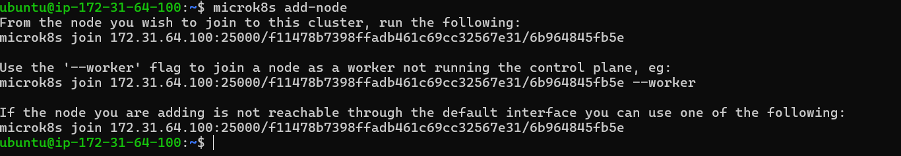

---

### 🔹 B06: Node 3 als Worker wieder hinzufügen
```bash
microk8s join 172.31.64.100:25000/... --worker
```
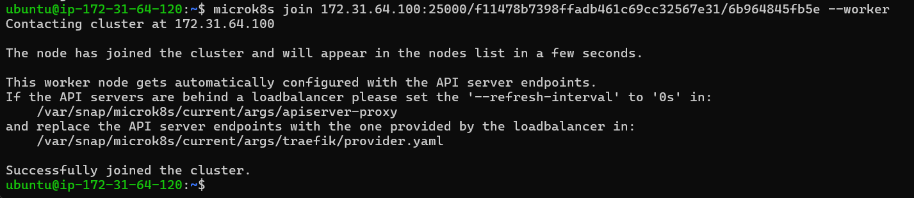

---

### 🔹 B07: Status von Node 3 nach Re-Join
```bash
microk8s status
```
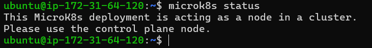

**Erklärung:**  
Der Worker übernimmt keine etcd-Funktion. Deshalb fehlen die Angaben zu `datastore master nodes`.

---

### 🔹 B08: `get nodes` auf Master (Node 1)
```bash
microk8s kubectl get nodes
```
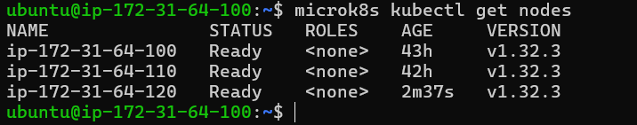

---

### 🔹 B09: `get nodes` auf Node 3 (Worker)
```bash
microk8s kubectl get nodes
```
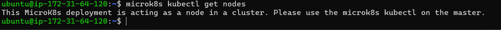

**Kommentar:**  
Da `kubectl` auf einem Worker nicht ausgeführt werden kann, erscheint der Hinweis, dass dieser Befehl nur auf einem Control-Plane-Node funktioniert.

---

##  Unterschied: `microk8s` vs. `microk8s kubectl`

###  Was ist `microk8s`?

`microk8s` ist das **Verwaltungswerkzeug für den MicroK8s-Dienst**. Es wird verwendet, um MicroK8s lokal auf einer Node zu steuern, Add-ons zu aktivieren oder Nodes zu verbinden.

####  Beispiele:
```bash
microk8s start

microk8s status

microk8s leave

microk8s add-node

microk8s enable dns
```

>  Diese Befehle wirken nur auf die lokale Node und verwalten MicroK8s als System.

---

###  Was ist `microk8s kubectl`?

`microk8s kubectl` ist das integrierte Kubernetes-Werkzeug in MicroK8s. Es wird genutzt, um mit dem **Kubernetes-Cluster** zu interagieren – z. B. Pods, Nodes, Deployments und Services zu verwalten.

####  Beispiele:
```bash
microk8s kubectl get nodes

microk8s kubectl get pods

microk8s kubectl create deployment nginx --image=nginx

microk8s kubectl delete pod <pod-name>

microk8s kubectl describe service <service-name>
```

>  Diese Befehle kommunizieren mit der Kubernetes API und wirken auf den gesamten Cluster.

---

###  Vergleichstabelle

| Befehl                     | Beschreibung                                          | Wirkt auf       |
|----------------------------|-------------------------------------------------------|------------------|
| `microk8s status`          | Zeigt lokalen MicroK8s-Zustand und Rollen            | lokale Node      |
| `microk8s leave`           | Node verlässt den Cluster                             | lokale Node      |
| `microk8s add-node`        | Gibt Join-Befehl zur Clustererweiterung aus          | lokale Node      |
| `microk8s kubectl get nodes` | Zeigt alle Nodes im Cluster                         | gesamter Cluster |
| `microk8s kubectl get pods`  | Zeigt alle Pods im Namespace                        | gesamter Cluster |

---

###  Merksatz:

>  `microk8s` = **Werkzeugkoffer für diese eine Maschine**  
>  `microk8s kubectl` = **Walkie-Talkie für den gesamten Cluster**


